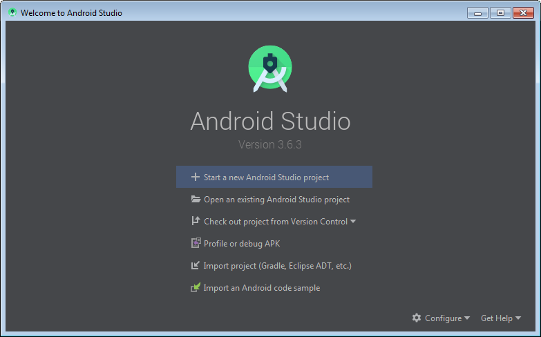
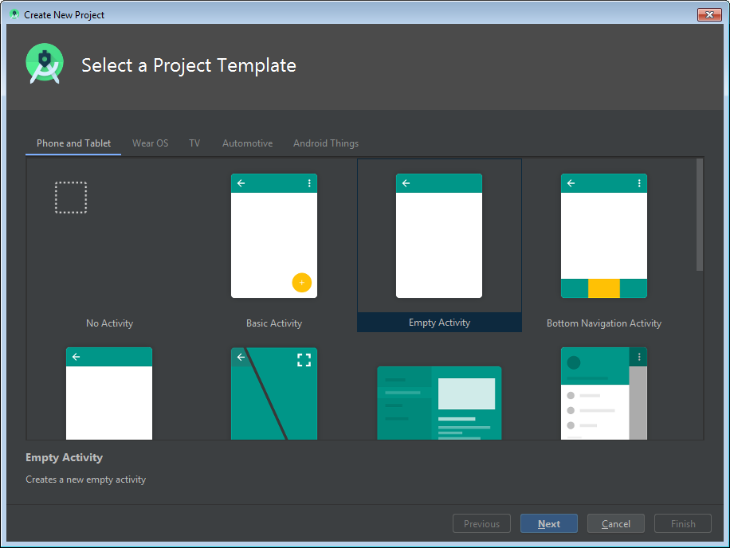
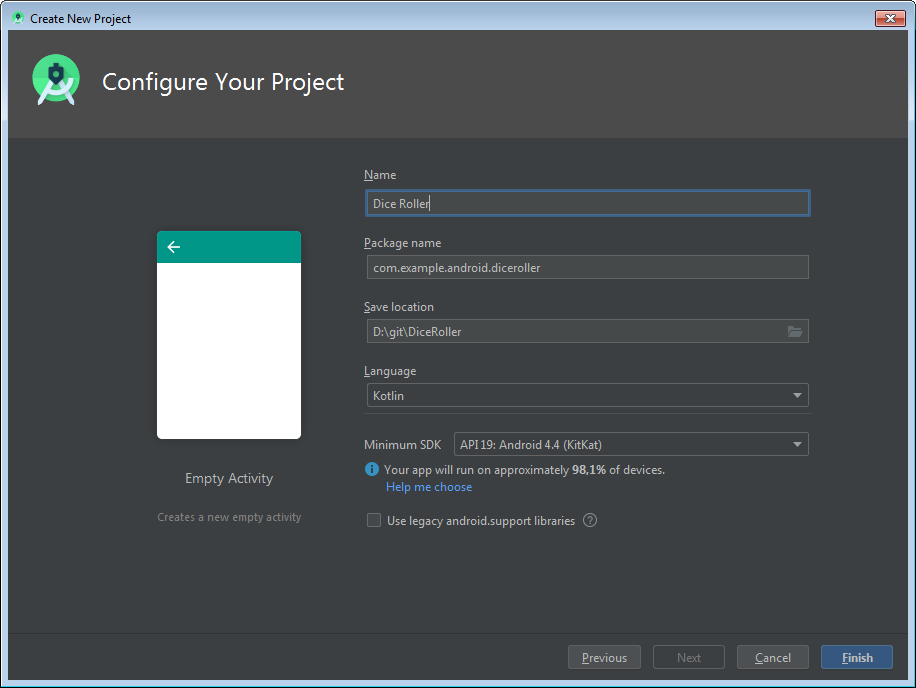

<youtube id="Uwmjq2P8AGU"></youtube>

The screencasts for these lessons were done with <strong>Android Studio Version 3.3</strong> , which is currently in Beta, which you can download from the Beta Channel in Android Studio. Select the Preferences menu (or Settings in Windows) and search for Appearances and Behavior &gt; System Settings &gt; Updates. There you can select Beta Channel and then click Check Now to locate and download the new version. If you want to learn more about Channels, see our Troubleshooting Guide <a target="_blank" href="https://s3.amazonaws.com/video.udacity-data.com/topher/2018/November/5be2884a_troubleshooting-guide-developing-android-apps-in-kotlin/troubleshooting-guide-developing-android-apps-in-kotlin.pdf">here</a>.

If you're curious about what API level 19 refers to, you can learn more <a target="_blank" href="https://en.wikipedia.org/wiki/Android_version_history">here</a>. This will also be discussed later in the lesson

<h1 id="making-your-first-app-dice-roller">Making Your First App: Dice Roller</h1>

The exercises for these lessons were done with <strong>Android Studio Version 3.3</strong>.

<h2 id="1-welcome-to-android-studio">1. Welcome to Android Studio</h2>

First, open Android Studio. You should see this window. Go ahead and click "Start a new Android Studio Project". An Android Studio Project typically means the code and files for one Android Application.

[Welcome to Android Studio]

<h2 id="2-choose-your-project">2. Choose your Project</h2>

On the next page you will be presented with several device platform tabs, each with different templates for adding an Activity.

From the "Phone and Tablet" tab choose "Empty Activity," and click "Next" again.

[Choose your Project]

<h2 id="3-configure-android-project">3. Configure Android Project</h2>

For this app use this configuration:

Name: Dice Roller 
Package: com.example.android.diceroller 
Project location: &lt; Your choice of where to save this project on your computer &gt; 
Language: Leave the default value 
Minimum API: leave the default values 

We've decided to build this project for "Phone and Tablet" with Minimum SDK of API 19. As of the time we wrote this course, that gave us 95.3% coverage of devices and allowed us to have support for many modern features.

Remember that you can use the "Help me choose" link to see the Android Platform/API Version distribution to see the percentage of active devices running with each API.

Finally, click "Finish" to create your Dice Roller project.

Depending on your computer and network speed, it might take a minute to set up and build your project. This might be a good time to do a stretch, get some tea, or start watching the next video.

[Configure your Project]

