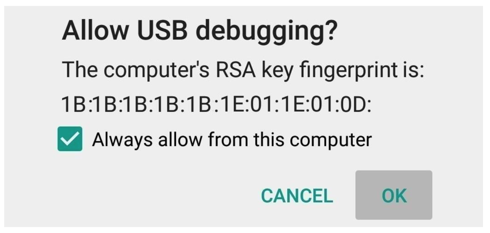

<youtube id="syaXHFE1bfI"></youtube>

Written instructions on how to enable the developer options and debugging in our device are <a target="_blank" href="https://developer.android.com/studio/debug/dev-options">here</a>.

If you use Windows, you will need to install the appropriate USB driver. For that you can follow the instructions <a target="_blank" href="https://developer.android.com/studio/run/oem-usb">here</a>. Mac and Linux users can skip this step.

When you connect your device, you should see a pop-up on the phone asking to allow USB debugging. You can tick the "Always allow" option as shown in the image to remember this computer. Click "OK".

You can now start running apps on your device.

If you still find issues during installation, please refer to this <a target="_blank" href="troubleshooting-guide-developing-android-apps-in-kotlin.pdf">Troubleshooting Guide</a>.

[Allow USB debugging prompt]

In this exercise, you will set up your development environment, create the Dice Roller project, and run it on a phone or emulator.

Task List

Install Android Studio

Create the Dice Roller Project.

Setup a physical device and/or emulator.

Run the app on a phone and/or an emulator.

<h4>Supporting Materials</h4>
<a href="troubleshooting-guide-developing-android-apps-in-kotlin.pdf" target="_blank">Troubleshooting Guide - Developing Android Apps In Kotlin</a>
