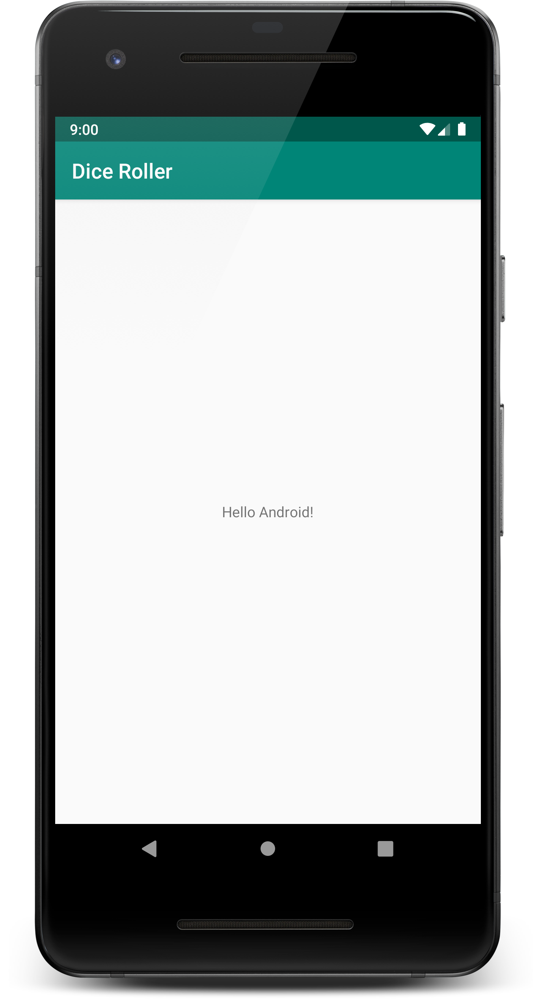

<youtube id="N4BOx2L_D-0"></youtube>
<p>Now it’s your turn to complete this exercise.</p>
<p>In this exercise, you will modify the text shown on the screen to say Hello Android.</p>
<p><strong>1. Open the MainActivity layout file and change the “Hello World!” to “Hello Android!”:</strong></p>
<p>You can do this by changing the text attribute in the XML:</p>

```ts
android:text="Hello Android"
```

<p>No other changes are needed! Since this exercise was so quick, we don't have a code step. But your final <code>activity_main.xml</code> code should look like:</p>

```xml
<androidx.constraintlayout.widget.ConstraintLayout xmlns:android="http://schemas.android.com/apk/res/android"
    xmlns:app="http://schemas.android.com/apk/res-auto"
    xmlns:tools="http://schemas.android.com/tools"
    android:layout_width="match_parent"
    android:layout_height="match_parent"
    tools:context=".MainActivity">

    <TextView
        android:layout_width="wrap_content"
        android:layout_height="wrap_content"
        android:text="Hello Android!"
        app:layout_constraintBottom_toBottomOf="parent"
        app:layout_constraintLeft_toLeftOf="parent"
        app:layout_constraintRight_toRightOf="parent"
        app:layout_constraintTop_toTopOf="parent" />

</androidx.constraintlayout.widget.ConstraintLayout>
```



<text-box variant='learningObjectives' name='Check the steps below as you implement them to complete this exercise.'>

- Make sure to set up an emulator, or connect computer to a physical device.

- Open the MainActivity layout file and change the “Hello World!” to “Hello Android!”

- Run the project and confirm that the text “Hello Android!” appears on the emulator or device.

</text-box>

Well done! Now it’s time to start building our Dice Roller app.

CONTINUE

<p>Reference documentation</p>
<ul>
<li><a target="_blank" href="https://developer.android.com/reference/android/app/Activity.html#setContentView(int)">setContentView</a></li>
</ul>
