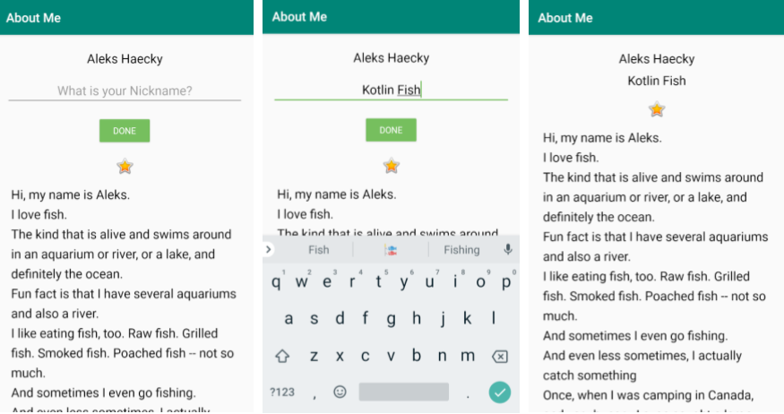

<youtube id="lS1sAKpdqhs"></youtube>

<h3 id="android-developer-documentation-">Android Developer Documentation:</h3>
<ul>
<li><a target="_blank" href="https://developer.android.com/reference/android/text/InputType">Input types</a></li>
<li><a target="_blank" href="https://developer.android.com/reference/android/widget/EditText">EditText</a></li>
<li><a target="_blank" href="https://developer.android.com/reference/android/widget/Button">Button</a></li>
</ul>

<p>In this exercise, do the following to finish out the <strong>AboutMe</strong> app:</p>
<ol>
<li>Add an <strong>EditText</strong> to get input for the nickname. Style with <strong>NameStyle</strong>. </li>
<li>Add a hidden <strong>TextView</strong> for displaying the inputted text. Style with <strong>NameStyle</strong>.</li>
<li>Add a <strong>Done</strong> button.</li>
<li>Add a click handler to the <strong>Done</strong> button that displays the inputted text in the <strong>TextView</strong> and hides the <strong>EditText</strong> and button. </li>
</ol>
<p>In your click handler:</p>
<ol>
<li>Find references to the <code>nickname_edit</code> and <code>nickname_text views</code>. </li>
<li>Set the text of <code>nickname_text</code> to the value of <code>nickname_edit</code>:
nicknameTextView.text = editText.text</li>
<li>Update the visibility of the views. Use <code>View.VISIBLE</code> and <code>View.GONE</code> to set the visibility of the views.</li>
</ol>
<p>In onCreate(), set a click handler like this:</p>

```ts
findViewById<Button>(R.id.done_button).setOnClickListener {
   addNickname(it)
}
```

<p><strong>Hint:</strong> In your click handler, add this code to hide the keyboard after input is complete:</p>

```ts
// Hide the keyboard.
val imm = getSystemService(Context.INPUT_METHOD_SERVICE) as InputMethodManager
imm.hideSoftInputFromWindow(view.windowToken, 0)
```

<p>Here is what your finished app should look like.</p>



<p>If you want to start at this step, you can download this exercise code from: <a target="_blank" href="https://github.com/udacity/andfun-kotlin-about-me/archive/Step.04-Exercise-EditText-DoneButton-ClickHandler.zip">Step.04-Exercise-EditText-DoneButton-ClickHandler</a>.</p>
<p>You will find plenty of <code>//TODO</code> comments to help you complete this exercise, and if you get stuck, go back and watch the video again.</p>
<p>Once you’re done, you can check your solution against the solution we’ve provided here <a target="_blank" href="https://github.com/udacity/andfun-kotlin-about-me/tree/Step.04-Solution-EditText-DoneButton-ClickHandler">Step.04-Solution-EditText-DoneButton-ClickHandler</a> or using this <a target="_blank" href="https://github.com/udacity/andfun-kotlin-about-me/compare/Step.04-Exercise-EditText-DoneButton-ClickHandler...Step.04-Solution-EditText-DoneButton-ClickHandler">git diff</a></p>

<text-box variant='learningObjectives' name='Check the steps below as you implement them to complete this exercise.'>

- Add EditText for entering a nickname.

- Add Done button.

- Add TextView for displaying the nickname.

- Add Click handler to Done button for processing the input and updating the visibility of views.

- Run your app, compare it to the screenshot, and verify that it works!

</text-box>

<div class="index-module--markdown--2MdcR ureact-markdown "><p>Great, now go and show your AboutMe app to a friend!</p>
<p>Solution: <a target="_blank" href="https://github.com/udacity/andfun-kotlin-about-me/tree/Step.04-Solution-EditText-DoneButton-ClickHandler">Step.04-Solution-EditText-DoneButton-ClickHandler</a> or <a target="_blank" href="https://github.com/udacity/andfun-kotlin-about-me/compare/Step.04-Exercise-EditText-DoneButton-ClickHandler...Step.04-Solution-EditText-DoneButton-ClickHandler">diff</a></p>
</div>

CONTINUE
