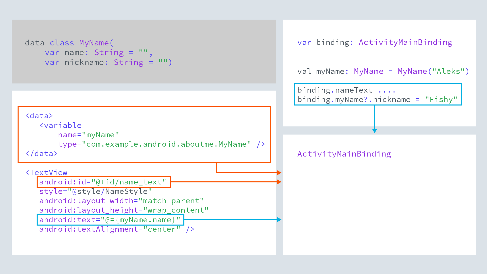

<h3 id="data-binding-the-idea">Data Binding - The Idea</h3>
<ul>
<li>The big idea about data binding is to create an object that connects/maps/binds two pieces of distant information together at compile time, so that you don't have to look for it at runtime.</li>
<li>The object that surfaces these bindings to you is called the Binding object. It is created by the compiler, and while understanding how it works under the hood is interesting, it is not necessary to know for basic uses of data binding. </li>
</ul>

<h3 id="data-binding-and-findviewbyid">Data Binding and findViewById</h3>
<ul>
<li>findViewById is a costly operation because it traverses the view hierarchy every time it is called. </li>
<li>With data binding enabled, the compiler creates references to all views in a <code>&lt;layout&gt;</code> that have an id, and gathers them in a Binding object.</li>
<li>In your code, you create an instance of the binding object, and then reference views through the binding object with no extra overhead. </li>
</ul>


<h3 id="data-binding-views-and-data">Data Binding Views and Data</h3>
<ul>
<li>Updating data and then updating the data displayed in views is cumbersome and a source of errors. Keeping the data in the view also violates separation of data and presentation.</li>
<li>Data binding solves both of these problems. You keep data in a data class. You add a <code>&lt;data&gt;</code> block to the <code>&lt;layout&gt;</code> to identify the data as variables to use with the views. Views reference the variables.</li>
<li>The compiler generates a binding object that binds the views and data.</li>
<li>In your code, you reference and update the data through the binding object, which updates the data, and thus what is displayed in the view.</li>
<li>Binding views to data sets a foundation for more advanced techniques using data binding.</li>
</ul>



<p>In this exercise you are going to improve the AboutMe app by using data binding instead of findViewById, and use actual data bound to the name_text and nickname_text views to display information.</p>

<p><strong>Do the following:</strong></p>
<ol>
<li><p>Enable data binding in your build.gradle file in the app module inside the android section:</p>

```ts
dataBinding {
enabled = true
}
```

</li>
<li><p>Wrap all views in activity_main.xml into a <code>&lt;layout&gt;</code> tag, and move the namespace declarations into the the <code>&lt;layout&gt;</code> tag.</p>
</li>
<li>In MainActivity, create a binding object:

```ts
private lateinit var binding: ActivityMainBinding
```

</li>
<li>In onCreate, use DataBindingUtil to set the content view:

```ts
binding = DataBindingUtil.setContentView(this, R.layout.activity_main)
```

</li>
<li>Use the binding object to replace all calls to findViewById, for example:

```ts
binding.doneButton.setOnClickListener….etc
```

</li>
</ol>
<p><strong>Hint:</strong> You can use apply() in the click handler to make your code more concise and readable.</p>
<ol>
<li>Create a data class MyName for the name and nickname.

```ts
data class MyName(var name: String = "", var nickname: String = "")
```

</li>
<li>Add a <code>&lt;data&gt;</code> block to activity_main.xml. The data block goes inside the layout tag but before the view tags. Inside the data block, add a variable for the MyName class.

```xml
<data>
<!-- Declare a variable by specifying a name and a data type. -->
<!-- Use fully qualified name for the type. -->
<variable
    name="myName"
    type="com.example.android.aboutme.MyName" />
</data>
```

</li>
<li>In name_text, nickname_edit, and nickname_text, replace the references to string text resources with references to the variables, for example

```ts
android:text="@={myName.name}"
```

</li>
<li>In MainActivity, create an instance of MyName.

```ts
// Instance of MyName data class.
private val myName: MyName = MyName("Aleks Haecky")
```

</li>
<li>And in onCreate(), set binding.myName to it.

```ts
binding.myName = myName
```

</li>
<li>In addNickname, set the value of nickname in myName, call invalidateAll(), and the data should show in your views.

```ts
myName?.nickname = nicknameEdit.text.toString()
// Invalidate all binding expressions and request a new rebind to refresh UI
invalidateAll()
```

</li>
<li>When you run your code, it should have no errors and look and work exactly the same!</li>
</ol>
<p>If you want to start at this step, you can download this exercise code from: <a target="_blank" href="https://github.com/udacity/andfun-kotlin-about-me/archive/Step.05-Exercise-Implement-data-binding.zip">Step.05-Exercise-Implement-data-binding</a>.</p>
<p>You will find plenty of <code>//TODO</code> comments to help you complete this exercise, and if you get stuck, go back and watch the video again.</p>
<p>Once you’re done, you can check your solution against the solution we’ve provided here <a target="_blank" href="https://github.com/udacity/andfun-kotlin-about-me/tree/Step.05-Solution-Implement-data-binding">Step.05-Solution-Implement-data-binding</a> or using this <a target="_blank" href="https://github.com/udacity/andfun-kotlin-about-me/compare/Step.05-Exercise-Implement-data-binding...Step.05-Solution-Implement-data-binding">git diff</a></p>

<text-box variant='learningObjectives' name="Now it's your turn to replace findViewById &amp; connect data to views.  Check the steps below as you implement them to complete this exercise.">

- Add data binding to gradle.

- Change activity_main.xml to use a <code>&lt;layout&gt;</code> tag.

- Create a binding object in the MainActivity.

- In onCreate(), use DataBindingUtil to set the layout for MainActivity.

- In MainActivity, use the binding object to replace all calls to findViewById.

- Create a new data class MyName for the name and nickname.

- In activity_main.xml, add a data block with a variable myName for the MyName class.

- In activity_main.xml, replace references to name and nickname string resources with references to the variable.

- In MainActivity, create an instance of MyName and set binding.myName to it.

- In addNickname(), set the nickname in the binding object and invalidateAll().

</text-box>

<p>Congratulations, that was a big chunk of work!</p>
<p>Solution: <a target="_blank" href="https://github.com/udacity/andfun-kotlin-about-me/tree/Step.05-Solution-Implement-data-binding">Step.05-Solution-Implement-data-binding</a> or <a target="_blank" href="https://github.com/udacity/andfun-kotlin-about-me/compare/Step.05-Exercise-Implement-data-binding...Step.05-Solution-Implement-data-binding">diff</a></p>
CONTINUE
