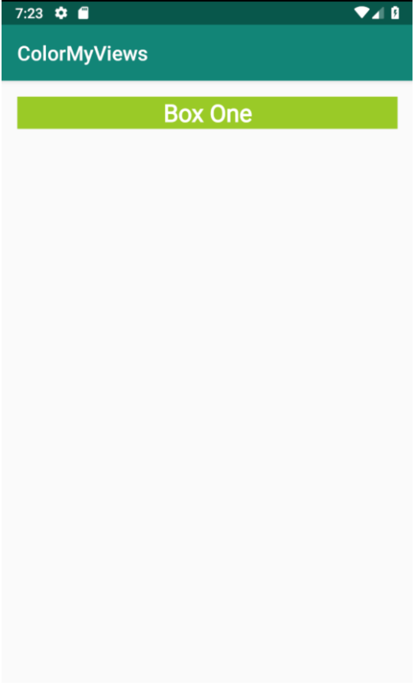

<youtube id="ZBqYeNOQIgY"></youtube>

<h3 id="android-developer-documentation-">Android Developer Documentation:</h3>
<ul>
<li><a target="_blank" href="https://developer.android.com/training/constraint-layout/">Build a Responsive UI with ConstraintLayout</a></li>
<li><a target="_blank" href="https://developer.android.com/reference/android/support/constraint/ConstraintLayout">ConstraintLayout</a></li>
<li><a target="_blank" href="https://developer.android.com/studio/write/layout-editor">Build a UI with Layout Editor</a></li>
<li><a target="_blank" href="https://android-developers.googleblog.com/2017/08/understanding-performance-benefits-of.html">Understanding the performance benefits of ConstraintLayout</a></li>
</ul>

<p>In this exercise you are going to create the ColorMyViews project and add, align, and style the first box. </p>
<ol>
<li>Create an Android Studio project named ColorMyViews, check "Include Kotlin support", minSDK19; choose the "Empty Activity" template; check generate a layout file and compatibility. Run the app and it should display "Hello World!" in a TextView.</li>
<li>Open activity_main.xml in Design view. </li>
<li>Explore the layout editor and familiarize yourself with its different panels and controls. </li>
<li>Change the default margin to 16. </li>
<li>Play with the Hello World box. Move the view and change its dimensions. Explore attributes. What happens if you add or move constraints? Change the bias? Remember that you can undo any actions to return to your starting point. </li>
<li>Move the box into the upper-left corner with margins of 16dp. Give it an id of box_one_text and create a string resource box_one with a value of "Box One" for the text. </li>
<li>Change the size and constraints of the box so that is glued to the top, and fills the width of the layout (match_constraint)  and the height of the text (wrap_content). </li>
<li>Add a style as shown in the code snippet below and style the box with it. You will have to add the roboto font to your project as for the AboutMe app. Style the box, extract the style, and extract the dimensions. </li>
<li>Run your app and it should look like the image below. </li>
</ol>
<p>Code snippet for the WhiteBox style:</p>

```xml
<style name="WhiteBox">
   <item name="android:background">@android:color/holo_green_light</item>
   <item name="android:textAlignment">center</item>
   <item name="android:textSize">24sp@dimen/box_text_size</item>
   <item name="android:textStyle">bold</item>
   <item name="android:textColor">@android:color/white</item>
   <item name="android:fontFamily">@font/roboto</item>
</style>
```



<p>If you want to start at this step, you can download this exercise code from: <a target="_blank" href="https://github.com/udacity/andfun-kotlin-color-my-views/archive/Step.01-Exercise-Add-Box-One.zip">Step.01-Exercise-Add-Box-One</a>.</p>
<p>You will find plenty of <code>//TODO</code> comments to help you complete this exercise, and if you get stuck, go back and watch the video again.</p>
<p>Once you’re done, you can check your solution against the solution we’ve provided here <a target="_blank" href="https://github.com/udacity/andfun-kotlin-color-my-views/tree/Step.01-Solution-Add-Box-One">Step.01-Solution-Add-Box-One</a> or using this <a target="_blank" href="https://github.com/udacity/andfun-kotlin-color-my-views/compare/Step.01-Exercise-Add-Box-One...Step.01-Solution-Add-Box-One">git diff</a>.</p>

<text-box variant='learningObjectives' name='Check the steps below as you implement them to complete this exercise.'>

- Create a project and app for your own version of ColorMyViews.

- Set default margin.

- Create, align, and style Box One.

</text-box>

<p>Good start!</p>
<p>Solution: <a target="_blank" href="https://github.com/udacity/andfun-kotlin-color-my-views/tree/Step.01-Solution-Add-Box-One">Step.01-Solution-Add-Box-One</a> or <a target="_blank" href="https://github.com/udacity/andfun-kotlin-color-my-views/compare/Step.01-Exercise-Add-Box-One...Step.01-Solution-Add-Box-One">diff</a></p>
