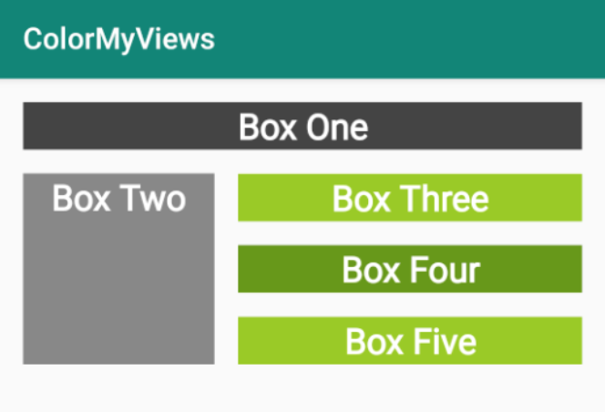

<youtube id="8lYQIYUD2_U"></youtube>

<h3 id="android-developer-documentation-">Android Developer Documentation:</h3>
<ul>
<li><a target="_blank" href="https://developer.android.com/reference/android/support/constraint/ConstraintLayout">Constraint Layout</a></li>
</ul>

<p>In this exercise you are going to add four more aligned boxes to your layout, modify the style, and then add a click handler to color the boxes when they are clicked. The image below shows how your layout should look.</p>
<ol>
<li>Add Box Two to your layout. Set the width and height to 130dp. Align it below Box One and to the left edge of the screen.</li>
<li>Add boxes Three, Four, and Five below Box One and to the right of Box Two. Make them identically shaped, vertically aligned. The top of Box Three is aligned with the top of Box Two, and the bottom of Box Five is aligned with the bottom of Box Two. See the image below for reference and use a chain, additional constraints, and margins to achieve your objective.</li>
<li>Add a click handler to MainActivity. Since this lesson is not about click handlers, the code is provided below for you to copy and paste.</li>
<li>Update the WhiteBox style so that the boxes start out white with white font. </li>
</ol>
<h3 id="click-handler-code">Click Handler Code</h3>

```ts
fun makeColored(view: View) {
   when (view.id) {

       // Boxes using Color class colors for background
       R.id.box_one_text -> view.setBackgroundColor(Color.DKGRAY)
       R.id.box_two_text -> view.setBackgroundColor(Color.GRAY)

       // Boxes using Android color resources for background
       R.id.box_three_text -> view.setBackgroundResource(android.R.color.holo_green_light)
       R.id.box_four_text -> view.setBackgroundResource(android.R.color.holo_green_dark)
       R.id.box_five_text -> view.setBackgroundResource(android.R.color.holo_green_light)

       else -> view.setBackgroundColor(Color.LTGRAY)
   }
}
```

<p>If you get stuck, revisit the coding steps in the screencasts and use the solution code to compare your answers.</p>



<p>If you want to start at this step, you can download this exercise code from: <a target="_blank" href="https://github.com/udacity/andfun-kotlin-color-my-views/archive/Step.02-Exercise-Align-boxes-Click-handlers.zip">Step.02-Exercise-Align-boxes-Click-handlers</a>.</p>
<p>You will find plenty of <code>//TODO</code> comments to help you complete this exercise, and if you get stuck, go back and watch the video again.</p>
<p>Once you’re done, you can check your solution against the solution we’ve provided here <a target="_blank" href="https://github.com/udacity/andfun-kotlin-color-my-views/tree/Step.02-Solution-Align-boxes-Click-handlers">Step.02-Solution-Align-boxes-Click-handlers</a> or using this <a target="_blank" href="https://github.com/udacity/andfun-kotlin-color-my-views/compare/Step.02-Exercise-Align-boxes-Click-handlers...Step.02-Solution-Align-boxes-Click-handlers">git diff</a>.</p>

<text-box variant='learningObjectives' name='Check the steps below as you implement them to complete this exercise.'>

- Add square Box Two below Box One and align to the left of the layout.

- Add a vertical, aligned chain of identical boxes; Box Three, Box Four, and Box Five below Box One and to the right of Box Two. The top of Box Three is aligned with the top of Box Two, and the bottom of Box Five is aligned with the bottom of Box Two.  Compare with the reference image above.

- Add the provided click handler and update the WhiteBox style.

- When you run the app, the boxes start out white, and clicking on them adds the colored background.

</text-box>


<p>All done with boxes!</p>
<p>Solution: <a target="_blank" href="https://github.com/udacity/andfun-kotlin-color-my-views/tree/Step.02-Solution-Align-boxes-Click-handlers">Step.02-Solution-Align-boxes-Click-handlers</a> or <a target="_blank" href="https://github.com/udacity/andfun-kotlin-color-my-views/compare/Step.02-Exercise-Align-boxes-Click-handlers...Step.02-Solution-Align-boxes-Click-handlers">diff</a></p>

CONTINUE
