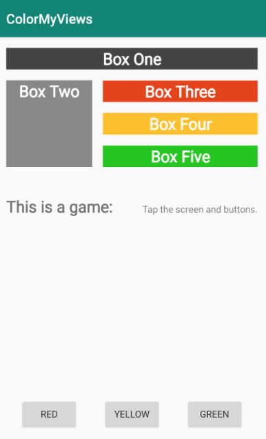

<youtube id="eTUqF9egdAM"></youtube>

<h3 id="android-developer-documentation-">Android Developer Documentation:</h3>
<ul>
<li><a target="_blank" href="https://developer.android.com/studio/write/layout-editor">Build a UI with Layout Editor</a></li>
<li><a target="_blank" href="https://developer.android.com/reference/android/support/constraint/ConstraintLayout">Constraint Layout</a></li>
</ul>

<p>For the final functionality of ColorMyViews, you will do the following: </p>
<ol>
<li><p>Below the set of boxes, add two TextViews; think of a label and some information. Use different font sizes for the label and text. The solution app only uses one line of text to avoid overlapping views on smaller devices, but you can experiment with a longer string.</p>
</li>
<li><p>Add a Baseline Constraint from the label to the info. </p>
</li>
<li><p>To situate these TextViews in the layout, add a fixed constraint of 16dp between the label and the info. This assures that they won't overlap, even if their width changes. </p>
</li>
<li><p>Constrain the top of info TextView to the bottom of BoxTwo, and use bias to vertically place it in the layout. Also, constrain both TextViews horizontally to the parent.</p>
</li>
<li><p>Add a horizontal chain of three buttons constrained to the bottom of the layout. Add any necessary constraints.</p>
</li>
<li><p>Test your layout by choosing different devices and orientations. The layout will not work for all of them, but should work for most. </p>
</li>
<li><p>Add the code shown below to the click handler. Don't forget to add the buttons to the list of views that are associated with the click handler.</p>
</li>
</ol>
<h4 id="code-to-add-to-click-handler-">Code to add to click handler:</h4>

```ts
// Boxes using custom colors for background
   R.id.red_button -> box_three_text.setBackgroundResource(R.color.my_red)
   R.id.yellow_button -> box_four_text.setBackgroundResource(R.color.my_yellow)
   R.id.green_button -> box_five_text.setBackgroundResource(R.color.my_green)
```

<h4 id="code-for-the-complete-list-of-views-">Code for the complete list of views:</h4>

```ts
val clickableViews: List<View> =
       listOf(box_one_text, box_two_text, box_three_text,
               box_four_text, box_five_text, constraint_layout,
               red_button, green_button, yellow_button)
```

<p>Here is a screenshot of the finished app.</p>



<p>If you want to start at this step, you can download this exercise code from: <a target="_blank" href="https://github.com/udacity/andfun-kotlin-color-my-views/archive/Step.03-Exercise-Basline-constraint-Button-chain.zip">Step.03-Exercise-Basline-constraint-Button-chain</a>.</p>
<p>You will find plenty of <code>//TODO</code> comments to help you complete this exercise, and if you get stuck, go back and watch the video again.</p>
<p>Once you’re done, you can check your solution against the solution we’ve provided here <a target="_blank" href="https://github.com/udacity/andfun-kotlin-color-my-views/tree/Step.03-Solution-Basline-constraint-Button-chain">Step.03-Solution-Basline-constraint-Button-chain</a> or using this <a target="_blank" href="https://github.com/udacity/andfun-kotlin-color-my-views/compare/Step.03-Exercise-Basline-constraint-Button-chain...Step.03-Solution-Basline-constraint-Button-chain">git diff</a>.</p>

<text-box variant='learningObjectives' name='Check the steps below as you implement them to complete this exercise.'>

- Add two TextViews with different font sizes and align them using a Baseline Constraint.

- Add a chain of three buttons constrained to the bottom of the layout.

- Update the click handler to handle the button clicks for color changes.

</text-box>

<p>And that is the complete app for ColorMyViews. Congratulations!</p>
<p>Solution: <a target="_blank" href="https://github.com/udacity/andfun-kotlin-color-my-views/tree/Step.03-Solution-Basline-constraint-Button-chain">Step.03-Solution-Basline-constraint-Button-chain</a> or <a target="_blank" href="https://github.com/udacity/andfun-kotlin-color-my-views/compare/Step.03-Exercise-Basline-constraint-Button-chain...Step.03-Solution-Basline-constraint-Button-chain">diff</a></p>

CONTINUE
