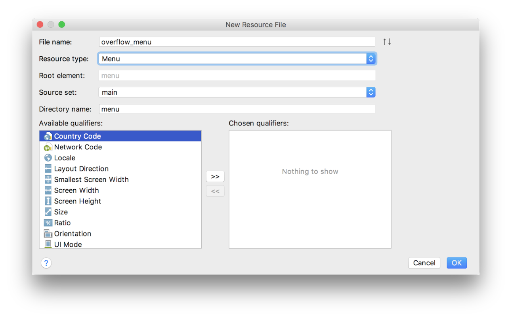
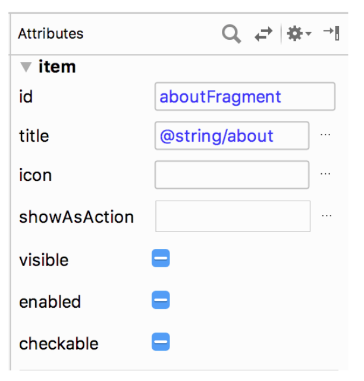

<youtube id="Qwg_MzCTQuQ"></youtube>

<p>Okay… let's add an About menu!</p>
<p>We’ll begin by adding the AboutFragment to the navigation graph. </p>
<p><strong>1. Add AboutFragment to the navigation graph</strong></p>
<p>Click the "add" button.  A list of fragments and activities will drop down.  Add fragment_about. Name it with the title_about_trivia string.  Set its id to aboutFragment.  The menu will need this id to navigate to the correct fragment.</p>
<p><strong>2. Create new menu resource.</strong></p>
<p>Right click on the res folder within the Android project and select New Resource File.  We’ll call this one overflow_menu, with resource type of Menu. Click on the overflow_menu within the menu directory, to view our new (empty) menu.</p>

<p><strong>3. Create “About” menu item with ID of aboutFragment destination</strong></p>
<p>Make sure the design tab is selected.  Drag a menu item from the palette into the component tree below.  Move to the attributes pane.  Set the new item's id to aboutFragment, its destination.  That's the id you used when adding the About fragment to the navigation graph.  For title, we can use @string/about.  The rest of the attributes should be left as their defaults.</p>

<p><strong>4. Call setHasOptionsMenu() in onCreateView of TitleFragment</strong></p>
<p>Next we need to tell Android that our TitleFragment has a menu.  In onCreateView call setHasOptionsMenu(true).</p>

```ts
override fun onCreateView(inflater: LayoutInflater, container: ViewGroup?,
                         savedInstanceState: Bundle?): View? {
   ...
   setHasOptionsMenu(true)
   return binding.root
}
```

<p><strong>5. Override onCreateOptionsMenu and inflate menu resource</strong></p>
<p>Next we need to override onCreateOptionsMenu and inflate our new menu resource using the provided menu inflater and menu structure.</p>

```ts
override fun onCreateOptionsMenu(menu: Menu?, inflater: MenuInflater?) {
   super.onCreateOptionsMenu(menu, inflater)
   inflater?.inflate(R.menu.overflow_menu, menu)
}
```

<p><strong>6. Override onOptionsItemSelected and call NavigationUI.onNavDestinationSelected</strong></p>
<p>Finally, we need to override onOptionsItemSelected to connect it to our NavigationUI.</p>

```java
override fun onOptionsItemSelected(item: MenuItem?): Boolean {
   return NavigationUI.onNavDestinationSelected(item!!,
           view!!.findNavController())
           || super.onOptionsItemSelected(item)
}
```

<p>And that’s it.  Run the app and enjoy the "About" feature we’ve just added to the title fragment.</p>
<p>If you want to start at this step, you can download this exercise code from: <a target="_blank" href="https://github.com/udacity/andfun-kotlin-android-trivia/archive/Step.06-Exercise-Adding-the-About-Menu.zip">Step.06-Exercise-Adding-the-About-Menu</a>.</p>
<p>You will find plenty of <code>//TODO</code> comments to help you complete this exercise, and if you get stuck, go back and watch the video again.</p>
<p>Once you’re done, you can check your solution against the solution we’ve provided here <a target="_blank" href="https://github.com/udacity/andfun-kotlin-android-trivia/tree/Step.06-Solution-Adding-the-About-Menu">Step.06-Solution-Adding-the-About-Menu</a> or <a target="_blank" href="https://github.com/udacity/andfun-kotlin-android-trivia/compare/Step.06-Exercise-Adding-the-About-Menu...Step.06-Solution-Adding-the-About-Menu">diff</a>.</p>

<text-box variant='learningObjectives' name='Check the steps below as you implement them to complete this exercise.'>

- Check the steps below as you implement them to complete this exercise.

- Add AboutFragment to navigation graph.

- Create new menu resource.

- Create “About” menu item with ID of aboutFragment destination.

- Call setHasOptionsMenu() in onCreateView of TitleFragment.

- Add Override to onCreateOptionsMenu and inflated menu resource.

- Add Override to onOptionsItemSelected and call NavigationUI.onNavDestinationSeleected.

</text-box>

<p>And now you have a working About menu!</p>
<p>Solution: <a target="_blank" href="https://github.com/udacity/andfun-kotlin-android-trivia/tree/Step.06-Solution-Adding-the-About-Menu">Step.06-Solution-Adding-the-About-Menu</a> or <a target="_blank" href="https://github.com/udacity/andfun-kotlin-android-trivia/compare/Step.06-Exercise-Adding-the-About-Menu...Step.06-Solution-Adding-the-About-Menu">git diff</a></p>
<button>Continue</button>
