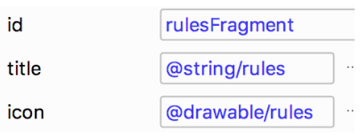
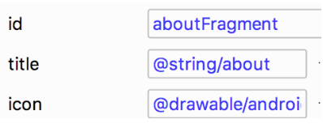

<youtube id="n4LJF4jras0"></youtube>

<p>Our Navigation Drawer will contain two menu items.  The first one points to the existing ‘About’ fragment, but the second one will point to a new Rules fragment, so we have to add it to the navigation graph. </p>
<p><strong>1. Add the RulesFragment to the navigation graph.</strong></p>
<p>Go to the navigation editor and click the "add" button. Add the rules fragment.</p>
<p><strong>2. Create the navDrawer menu with the rulesFragment and aboutFragment menu items</strong></p>
<p>Then, we have to create the navdrawer_menu.  Add two menu items by dragging menu items into the component tree.</p>
<p>The first item should have the id of the RulesFragment, the rules string and drawable</p>

<p>The second item should have the ID of the AboutFragment, the about string and the android drawable.</p>

<p><strong>3. Add the DrawerLayout into the activity_main layout containing the LinearLayout and navHostFragment</strong> </p>
<p>It should be just inside of the Data Binding <code>layout</code> tag.</p>

```xml
<layout xmlns:android="http://schemas.android.com/apk/res/android"
   xmlns:app="http://schemas.android.com/apk/res-auto">

   <androidx.drawerlayout.widget.DrawerLayout
       android:id="@+id/drawerLayout"
       android:layout_width="match_parent"
       android:layout_height="match_parent"
   >
```

<p><strong>4. Add the NavigationView at the bottom of the the DrawerLayout</strong></p>
<p>Now add the <code>NavigationView</code> at the bottom of the <code>DrawerLayout</code>.</p>

```xml
<com.google.android.material.navigation.NavigationView
   android:id="@+id/navView"
   android:layout_width="wrap_content"
   android:layout_height="match_parent"
   android:layout_gravity="start"
   app:menu="@menu/navdrawer_menu" />
```

<p><strong>5. Move to MainActivity and add <code>private lateinit</code> vars for drawerLayout and appBarConfiguration.</strong></p>

```ts
private lateinit var drawerLayout: DrawerLayout
private lateinit var appBarConfiguration: AppBarConfiguration
```

<p><strong>6. Initialize the drawerLayout from the binding variable.</strong></p>

```ts
drawerLayout = binding.drawerLayout
```

<p><strong>7. Add the DrawerLayout as the third parameter to setupActionBarWithNavController</strong></p>
<p>Add the drawerLayout as the third parameter to the setupActionBarWithNavController method.  NOTE: If Android Studio displays an error, you may have to rebuild your project before using the binding variable.</p>

```ts
drawerLayout = binding.drawerLayout
val navController = this.findNavController(R.id.myNavHostFragment)
NavigationUI.setupActionBarWithNavController(this, navController, drawerLayout)
```

<p><strong>8. Create an appBarConfiguration with the navController.graph and drawerLayout</strong></p>

```ts
appBarConfiguration = AppBarConfiguration(navController.graph, drawerLayout)
```

<p><strong>9. Hook up the navigation UI up to the navigation view.</strong></p>
<p>And then hook the navigation UI up to the navigation view by calling setupWithNavController.</p>

```ts
NavigationUI.setupWithNavController(binding.navView, navController)
```

<p><strong>10. In onSupportNavigateUp, replace navController.navigateUp with NavigationUI.navigateUp with drawerLayout as parameter</strong></p>
<p>And, in our onSupportNavigateUp activity method, we need to use NavigationUI.navigateUp with the drawerLayout as a parameter instead of navController.navigateUp.</p>

```ts
override fun onSupportNavigateUp(): Boolean {
   val navController = this.findNavController(R.id.myNavHostFragment)
   return NavigationUI.navigateUp(drawerLayout, navController)
}
```

<p>And that’s it.  We have a working app drawer.   Let's add the navigation header to finish things.</p>
<p><strong>11. In the NavigationView at the bottom of the DrawerLayout within the main activity layout file, add the nav header as the headerLayout.</strong></p>

```xml
<com.google.android.material.navigation.NavigationView
   android:id="@+id/navView"
   android:layout_width="wrap_content"
   android:layout_height="match_parent"
   android:layout_gravity="start"
   app:headerLayout="@layout/nav_header"
   app:menu="@menu/navdrawer_menu" />
```

<p>If you want to start at this step, you can download this exercise code from: <a target="_blank" href="https://github.com/udacity/andfun-kotlin-android-trivia/archive/Step.09-Exercise-Adding-the-Navigation-Drawer.zip">Step.09-Exercise-Adding-the-Navigation-Drawer</a>.</p>
<p>You will find plenty of <code>//TODO</code> comments to help you complete this exercise, and if you get stuck, go back and watch the video again.</p>
<p>Once you’re done, you can check your solution against the solution we’ve provided here <a target="_blank" href="https://github.com/udacity/andfun-kotlin-android-trivia/tree/Step.09-Solution-Adding-the-Navigation-Drawer">Step.09-Solution-Adding-the-Navigation-Drawer</a> or <a target="_blank" href="https://github.com/udacity/andfun-kotlin-android-trivia/compare/Step.09-Exercise-Adding-the-Navigation-Drawer...Step.09-Solution-Adding-the-Navigation-Drawer">git diff</a>.</p>

<text-box variant='learningObjectives' name='Check the steps below as you implement them to complete this exercise.'>

- Add the RulesFragment to the navigation graph.

- Create the navDrawer menu with the rulesFragment and aboutFragment menu items.

- Add the DrawerLayout into the activity_main layout containing the LinearLayout and navHostFragment.

- Add the NavigationView at the bottom of the the DrawerLayout.

- Add the DrawerLayout as the third parameter to setupActionBarWithNavController.

- Create an appBarConfiguration with the navController.graph and drawerLayout

- Hook up the navigation UI up to the navigation view.

- In onSupportNavigateUp, replace navController.navigateUp with NavigationUI.navigateUp with drawerLayout and navController as parameters.

</text-box>

<p>Thanks!</p>
<p>Solution: <a target="_blank" href="https://github.com/udacity/andfun-kotlin-android-trivia/tree/Step.09-Solution-Adding-the-Navigation-Drawer">Step.09-Solution-Adding-the-Navigation-Drawer</a> or <a target="_blank" href="https://github.com/udacity/andfun-kotlin-android-trivia/compare/Step.09-Exercise-Adding-the-Navigation-Drawer...Step.09-Solution-Adding-the-Navigation-Drawer">git diff</a></p>
<button>Continue</button>
