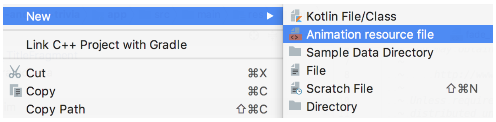
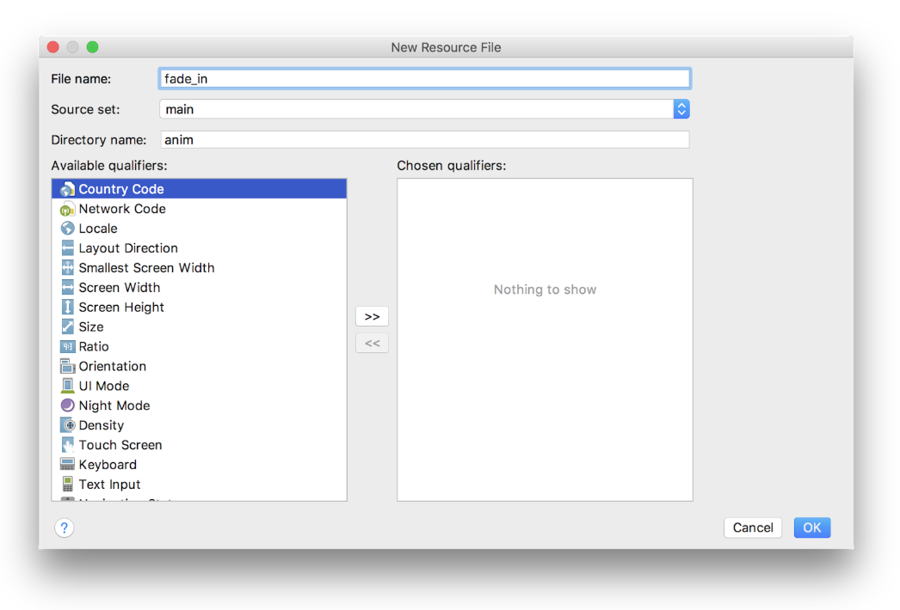
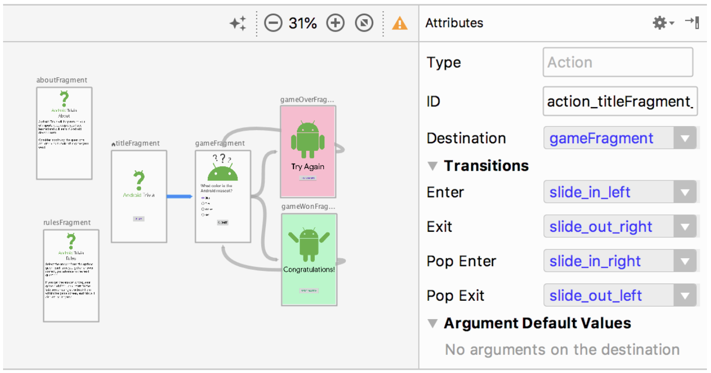
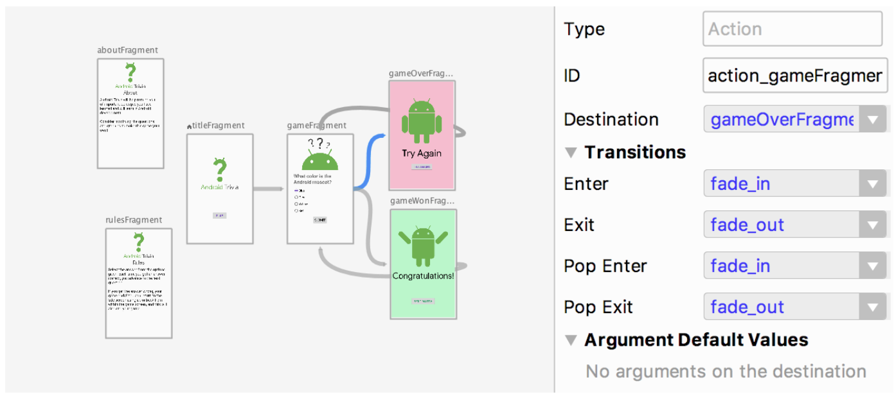

<youtube id="pUg2HZeoxkY"></youtube>

<p>Let’s animate stuff!  First we have to create some animation resources.  You’ll see that I’ve already added a bunch of them, but you need to create the fade_in animation and the slide_in_left animation.</p>
<p><strong>1. Create fade in animation resource.</strong></p>
<p>We can do this by right clicking on the anim folder with New-&gt;Animation resource file.</p>

<p>Great! We then create our animation called fade_in.</p>

<p>When we open the newly created fade_in.xml file, it will contain an empty animation set:</p>

```xml
<set xmlns:android="http://schemas.android.com/apk/res/android">
</set>
```

<p>We need to add an alpha animation in there, going from 0 to 1 (fading in) and taking the medium animation time. We do that by setting fromAlpha to 0, toAlpha to 1, and the duration to @android:integer/config_mediumAnimTime</p>

´´´xml
<!-- Fade In Animation -->
<set xmlns:android="http://schemas.android.com/apk/res/android">
   <alpha
       android:duration="@android:integer/config_mediumAnimTime"
       android:fromAlpha="0.0"
       android:toAlpha="1.0" />
</set>
```

<p><strong>2. Create slide in left animation resource.</strong></p>
<p>We then need to do the same thing for the slide_in_left animation.  We start by creating the file, and get an empty animation set.  We then need to add a translate animation in there, going from -100% off screen in the X axis to 0% offscreen in the X axis.  Let’s do this one with a short duration.  For the Y axis, we’ll be at 0 (onscreen) at the start and end of the animation.</p>

```xml
<set xmlns:android="http://schemas.android.com/apk/res/android">
   <translate
       android:fromXDelta="-100%"
       android:toXDelta="0%"
       android:fromYDelta="0%"
       android:toYDelta="0%"
       android:duration="@android:integer/config_shortAnimTime" />
</set>
```

<p>So now we have animations.  Let’s add them to our actions!  </p>
<p><strong>3. Add transitions to all actions</strong></p>
<p>Our first action connects the TitleFragment to the GameFragment.  We’ll have it slide in from the left and out to the right when entering and exiting, and have it slide in from the right and out to the left when pop entering and pop exiting.</p>

<p>We repeat the same set of animations for the game fragment to the game won fragment, from the gameWonFragment to the gameFragment, and from the gameOverFragment to the gameFragment.  For the transition to the gameOverFragment, we’ll fade in and out instead.</p>

<p>And that’s it!  You should now have cool animations for all of your actions!</p>
<p>If you want to start at this step, you can download this exercise code from: <a target="_blank" href="https://github.com/udacity/andfun-kotlin-android-trivia/archive/Step.10-Exercise-Using-Navigation-Listeners.zip">Step.10-Exercise-Using-Navigation-Listeners</a>.</p>
<p>You will find plenty of <code>//TODO</code> comments to help you complete this exercise, and if you get stuck, go back and watch the video again.</p>
<p>Once you’re done, you can check your solution against the solution we’ve provided here <a target="_blank" href="https://github.com/udacity/andfun-kotlin-android-trivia/tree/Step.10-Solution-Using-Navigation-Listeners">Step.10-Solution-Using-Navigation-Listeners</a> or <a target="_blank" href="https://github.com/udacity/andfun-kotlin-android-trivia/compare/Step.10-Exercise-Using-Navigation-Listeners...Step.10-Solution-Using-Navigation-Listeners">git diff</a>.</p>

<text-box variant='learningObjectives' name='Let’s animate!  Check the steps below as you implement them to complete this exercise.'>
</text-box>

- Create fade in animation resource.

- Create slide in left animation resource.

- Add transitions to all actions.

</text-box>

<p>Great job!</p>
<p>Solution: <a target="_blank" href="https://github.com/udacity/andfun-kotlin-android-trivia/tree/Step.10-Solution-Using-Navigation-Listeners">Step.10-Solution-Using-Navigation-Listeners</a> or <a target="_blank" href="https://github.com/udacity/andfun-kotlin-android-trivia/compare/Step.10-Exercise-Using-Navigation-Listeners...Step.10-Solution-Using-Navigation-Listeners">git diff</a></p>
<button>Continue</button>
