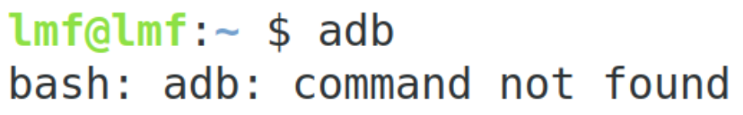
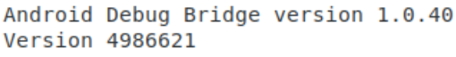

<youtube id="UwMcGa5zVtc"></youtube>

<h2 id="terminating-a-process">Terminating a process</h2>
<ol>
<li>Make sure you are using a device or emulator running at least API level 28. This is easier to set up for an emulator.</li>
<li>Make sure adb is installed. If not, see instructions below.</li>
<li>Make sure your app is in the background - this only happens when the app is in the background. You can do this by hitting the <strong>home</strong> button.</li>
<li><p>Run the command:</p>

```ts
adb shell am kill com.example.android.dessertpusher
```

<p>This will stop the process as-if it had been stopped by the Android operating system.</p>
</li>
</ol>
<h2 id="adding-adb-to-your-path">Adding ADB to your path</h2>
<p>If you try running adb in a terminal and you see something similar to the message below, read on:</p>



<p><a target="_blank" href="https://developer.android.com/studio/command-line/adb">ADB (Android Debug Bridge)</a> is command line tool, and if you want to use it from the command line, it needs to be part of your path. First you’ll find where the adb executable lives, then you’ll add that to your path.</p>
<p><strong>1. Find the platform-tools folder which contains adb:</strong></p>
<p>Adb is part of the Android SDK, which is downloaded as part of Android Studio. You can find the location of this SDK by going to <strong>Tools -&gt; SDK Manager</strong></p>


<p>ADB is located in this location, followed by platform-tools/ so in the example above, you could find adb in:</p>
<p>/Users/lmf/Library/Android/sdk/platform-tools/</p>
<p><strong>2. Add adb to your path:</strong></p>
<p>Adding a variable to your path varies by platform, follow the instructions below to add the platform-tools location you located above.</p>
<p><strong>Windows</strong></p>
<ol>
<li>Go to <strong>Advanced system settings:</strong><ul>
<li>Windows 8 and 10: <strong>Search -&gt; System (Control Panel) -&gt; Advanced system settings</strong></li>
<li>Windows 7: Right-click <strong>Computer -&gt; Properties -&gt; Advanced system settings</strong></li>
<li>Windows Vista: Right click <strong>My Computer -&gt; Properties -&gt; Advanced system settings</strong></li>
<li>Windows XP: <strong>Start -&gt; Control Panel -&gt; System -&gt; Advanced tab</strong></li>
</ul>
</li>
<li>Click <strong>Environment Variables</strong></li>
<li>Find the <strong>System Variables</strong> section and then look to see if you have a <strong>PATH</strong> environment variable: <ul>
<li>If you find one, click <strong>Edit</strong></li>
<li>If you do not find one, click <strong>New</strong> to add one</li>
</ul>
</li>
<li>Add <code>;&lt;Path to platform-tools&gt;</code> to the end of the <strong>Variable</strong> value box</li>
<li>Click <strong>OK</strong> on all windows to save</li>
<li>Ensure you can run adb by typing:<ul>
<li><code>adb</code></li>
</ul>
</li>
<li>You should see output, including something like:</li>
</ol>



<p><strong>Mac/Linux</strong></p>
<p>Adding a path variable is done using the terminal on Mac/Linux.</p>
<ol>
<li>Open a <strong>Terminal</strong></li>
<li>Create a <strong>.bash_profile</strong> file if you don’t have one already. This is a configuration file for <a target="_blank" href="https://en.wikipedia.org/wiki/Bash_(Unix_shell">bash</a>) - it’s executed when you start bash:<ul>
<li><code>touch ~/.bash_profile</code></li>
</ul>
</li>
<li>Open up the ~/.bash_profile file in your preferred text editor:<ul>
<li><code>open ~/.bash_profile</code></li>
</ul>
</li>
<li>Add the following to your .bash_profile file and save:<ul>
<li><code>export PATH=&lt;Path to platform-tools&gt;:$PATH</code></li>
</ul>
</li>
<li>Either restart your terminal, or enter:<ul>
<li><code>source ~/.bash_profile</code></li>
</ul>
</li>
<li>Ensure you can run adb by typing:<ul>
<li><code>adb</code></li>
</ul>
</li>
<li>You should see output, including something like:</li>
</ol>


