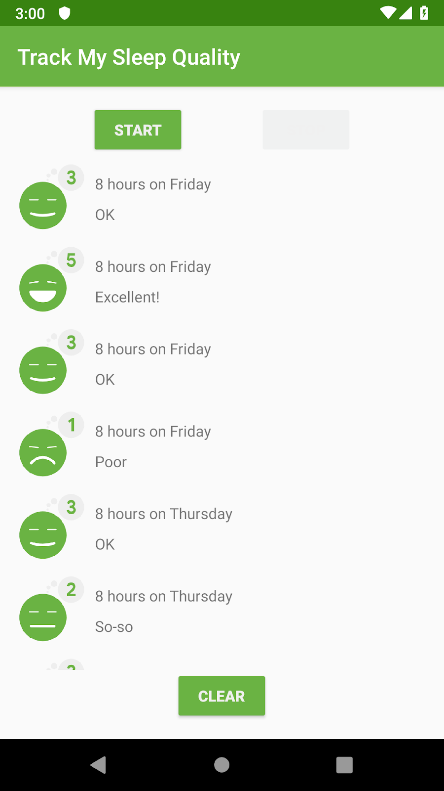
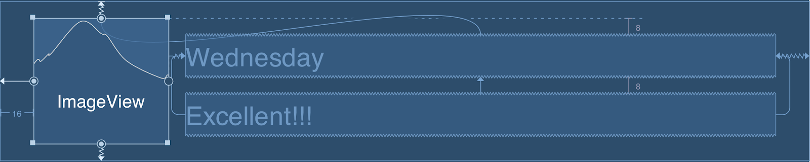

<youtube id="Y5na3abAiB8"></youtube>

<p>Now it's your turn to complete this exercise yourself.  </p>
<p>In this step you will implement a your own ViewHolder! You'll take the Adapter you finished in the last section and add a new ViewHolder to display a list of SleepQuality.</p>
<p>When you've completed this exercise you'll have a working RecyclerView that displays a styled list like this:</p>



<ol>
<li><strong>In <code>list_item_sleep_night</code>,  add views to the <code>ConstraintLayout</code> to build the design below.</strong></li>
</ol>



<p><strong>Tip</strong>: You can set preview text by using the field marked with .</p>

<ol start="2">
<li><p><strong>Add Add an <code>ImageView</code> and set its <code>id</code> to <code>quality_image</code>:</strong></p>

```ts
<ImageView
     android:id="@+id/quality_image"
     android:layout_width="@dimen/icon_size"
     android:layout_height="60dp"
     android:layout_marginStart="16dp"
     android:layout_marginTop="8dp"
     android:layout_marginBottom="8dp"
     app:layout_constraintBottom_toBottomOf="parent"
     app:layout_constraintStart_toStartOf="parent"
     app:layout_constraintTop_toTopOf="parent"
     tools:srcCompat="@drawable/ic_sleep_5" />
```

<p><br></p>
</li>
<li><p><strong>Add a TextView to the right of quality_image and set its id to sleep_length:</strong></p>

```ts
<TextView
     android:id="@+id/quality_string"
     android:layout_width="0dp"
     android:layout_height="20dp"
     android:layout_marginTop="8dp"
     app:layout_constraintEnd_toEndOf="@+id/sleep_length"
     app:layout_constraintStart_toStartOf="@+id/sleep_length"
     app:layout_constraintTop_toBottomOf="@+id/sleep_length"
     tools:text="Excellent!!!" />
```

<p><br></p>
</li>
<li><p><strong>Add a TextView to the right of quality_image and set its id to sleep_length:</strong></p>

```ts
<TextView
     android:id="@+id/sleep_length"
     android:layout_width="0dp"
     android:layout_height="20dp"
     android:layout_marginStart="8dp"
     android:layout_marginTop="8dp"
     android:layout_marginEnd="16dp"
     app:layout_constraintEnd_toEndOf="parent"
     app:layout_constraintStart_toEndOf="@+id/quality_image"
     app:layout_constraintTop_toTopOf="@+id/quality_image"
     tools:text="Wednesday" />
```

</li>
</ol>
<p><strong>In SleepNightAdapter</strong></p>
<ol>
<li><p><strong>Inside the SleepNightAdapter class, create a <code>ViewHolder</code> class that  extends <code>RecyclerView.ViewHolder</code>.</strong>
<br><br></p>
</li>
<li><p><strong>Use <code>findViewById</code> to find views.</strong> </p>
<p>Inside the <code>ViewHolder</code>, use <code>findViewById()</code> to create properties <code>sleepLength</code>, <code>quality</code>, and <code>qualityImage</code>.</p>
<p>Make sure <code>sleepLength</code> and <code>quality</code> are <code>TextViews</code>. Also ensure <code>qualityImage</code> is an <code>ImageView</code>:</p>

```ts
val sleepLength: TextView = itemView.findViewById(R.id.sleep_length)
val quality: TextView = itemView.findViewById(R.id.quality_string)
val qualityImage: ImageView = itemView.findViewById(R.id.quality_image)
```

<p><br></p>
</li>
<li><p><strong>Update SleepNightAdapter to use ViewHolder:</strong> </p>
<p>Go to the declaration of <code>SleepNightAdapter</code> and change the type parameter of <code>RecyclerView.Adapter</code> to <code>SleepNightAdapter.ViewHolder</code></p>

```ts
class SleepNightAdapter: RecyclerView.Adapter<SleepNightAdapter.ViewHolder>()
```

<p><strong>NOTE:</strong> Your code won't compile after making this change because it doesn’t implement all of the required overrides.  We’ll fix that in the next steps.
<br><br></p>
</li>
<li><p><strong>Change onCreateViewHolder()’s return type to <code>ViewHolder</code>, and inflate <code>list_item_sleep_night</code> instead of <code>text_item_view</code>:</strong></p>

```ts
override fun onCreateViewHolder(parent: ViewGroup, viewType: Int): ViewHolder {
  val layoutInflater = LayoutInflater.from(parent.context)
  val view = layoutInflater.inflate(R.layout.text_item_view, parent, false)

 return ViewHolder(view)
}
```

<p><em>Don’t forget</em> to remove <code>as TextView</code> from the call to <code>.inflate</code>, or your code will crash!
<br><br></p>
</li>
<li><p><strong>Update onBindViewHolder.</strong> </p>
<p>Change <code>onBindViewHolder</code> to take <code>holder: ViewHolder</code> as a parameter and update the views in <code>ViewHolder</code> to display icon resources instead of colors.</p>

```ts
override fun onBindViewHolder(holder: ViewHolder, position: Int) {
    val item = data[position]
    val res = holder.itemView.context.resources
    holder.sleepLength.text = convertDurationToFormatted(item.startTimeMilli, item.endTimeMilli, res)
    holder.quality.text = convertNumericQualityToString(item.sleepQuality, res)

    holder.qualityImage.setImageResource(when (item.sleepQuality) {
          0 -> R.drawable.ic_sleep_0
          1 -> R.drawable.ic_sleep_1
          2 -> R.drawable.ic_sleep_2
          3 -> R.drawable.ic_sleep_3
          4 -> R.drawable.ic_sleep_4
          5 -> R.drawable.ic_sleep_5
         else -> R.drawable.ic_sleep_active
   })
}
```

<p><br></p>
</li>
<li><p><strong>Run the app and you should see the styled list!</strong></p>
</li>
</ol>
<p>If you want to start at this step, you can download this exercise from: <a target="_blank" href="https://github.com/udacity/andfun-kotlin-sleep-tracker-with-recyclerview/archive/Step.04-Exercise-Display-SleepQuality-List.zip">Step.04-Exercise-Display-SleepQuality-List</a>.</p>
<p>You will find plenty of <code>//TODO</code> comments to help you complete this exercise, and if you get stuck, go back and watch the video again.</p>
<p>Once you’re done, you can check your solution against the solution we’ve provided here: <a target="_blank" href="https://github.com/udacity/andfun-kotlin-sleep-tracker-with-recyclerview/tree/Step.04-Solution-Display-SleepQuality-List">Step.04-Solution-Display-Sleep-Quality-List</a>, or using this <a target="_blank" href="https://github.com/udacity/andfun-kotlin-sleep-tracker-with-recyclerview/compare/Step.04-Exercise-Display-SleepQuality-List...Step.04-Solution-Display-SleepQuality-List">git diff</a>.</p>

<text-box variant='learningObjectives' name='Complete these tasks to add a <code>ViewHolder</code> that displays a list of sleep quality entries with images.'>

- Add an <code>ImageView</code> and set its <code>id</code> to <code>quality_image</code>.
- Add a <code>TextView</code> to the right of <code>quality_image</code> and set its <code>id</code> to <code>sleep_length</code>.
- Add a <code>TextView</code> below <code>sleep_length</code> and set its <code>id</code> to <code>quality_string</code>.
- Create a <code>ViewHolder</code> class that extends <code>RecyclerView.ViewHolder</code>.
- Inside the <code>ViewHolder</code>, use <code>findViewById()</code> to create properties for <code>sleepLength</code>,  <code>quality</code>, and <code>qualityImage</code>.
- Change <code>RecyclerView.Adapter</code>’s parameter to <code>&lt;SleepNightAdapter.ViewHolder&gt;</code>.
- Update view to inflate <code>list_item_sleep_night</code>, and change return type to <code>ViewHolder</code>.
- Change <code>onBindViewHolder</code>’s holder parameter type to <code>ViewHolder</code>, and update views.

</text-box>

<p>Great job! You've implemented a ViewHolder for RecyclerView. In the next steps you'll look at ways to improve this code with encapsulation.</p>
<button>Continue</button>
